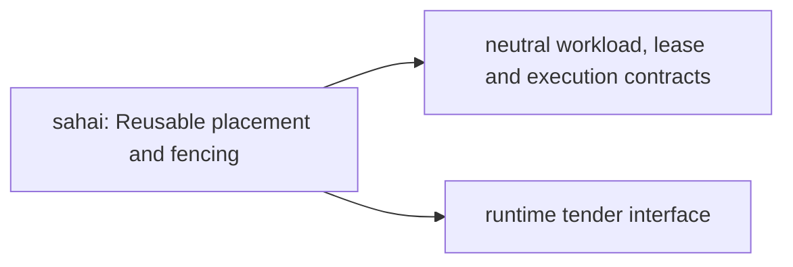

# sahai: stack integration

Status: accepted architecture direction, 2026-10-10. This document and
[composition metadata](../spec/stack-integration.edn) describe ownership and
future boundaries; they do not change runtime schemas or certify migration.

## Responsibility

Selects where and when bounded work is attempted and fences stale execution. Does not define language meaning, mint grants or establish consensus finality. Murakumo retains its inference-fleet control plane. An epoch/fence is not a quorum certificate. Persisted wire keys and lease formats remain compatible until explicit versioned migration.

## Contract dependency direction

Arrows are consumer → contract dependency. These are intended entrypoint
boundaries, not whole-repository imports already achieved.

The measured selected-owner production dependencies at base `31da0d776f7bf7a638248a41f4a5c2563a09c809`
are `kototama`.
This selection excludes other libraries; alias-only build/test imports remain
separate in the [full observation](https://github.com/kotoba-lang/kotoba-lang/blob/main/lang/stack-dependency-observation.edn).

## Shared architecture and refactor rules

- [Whole stack and distributed flow](https://github.com/kotoba-lang/kotoba-lang/blob/main/docs/stack-architecture-target-neutral.ja.md)
- [Machine-readable architecture direction](https://github.com/kotoba-lang/kotoba-lang/blob/main/lang/stack-architecture-target-neutral.edn)
- [Current measured dependency graph](https://github.com/kotoba-lang/kotoba-lang/blob/main/docs/stack-dependencies-current.md)
- [Coordinated refactor procedure](https://github.com/kotoba-lang/kotoba-lang/blob/main/docs/stack-refactor-procedure.md)
- [Japanese presentation](https://github.com/kotoba-lang/kotoba-lang/blob/main/docs/presentations/kotoba-lisp-machine.ja.md)

Target, host, distribution and consistency are independent selection axes; their
Cartesian product is not a support matrix. Unknown/unqualified profiles fail
closed. Preserve existing wire keys, CID rules and reader compatibility until
a versioned migration. Migrate whole components and public closures; Q9 is
JVM-free. Qualify actual artifacts, denied paths, limits and receipts per
target × host × operation × consistency.

Keep source dependencies, artifact flow, runtime composition and service
relationships separate. No readiness follows for debugger/live editing, heap
image restoration, selfhost, C-free production or physical hardware.
